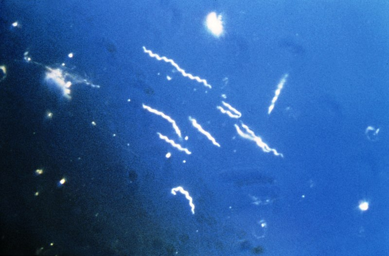

1. Import the Sequences.csv file.
```{r}
newbburg<-read.csv("Sequences.csv")
```


2. Using regular expressions, count the number of each base pair (A, T, C, and G) in each of the three sequences. 
```{r}
# Sequnce 1 (HQ433692.1)
seq1<-newbburg[2,2]
seq1<-gsub("692.1BorreliaburgdorferistrainQLZP116SribosomalRNAgene,partialsequence|[^A|T|C|G]", "", seq1, ignore.case=FALSE)
seq1table<-table(strsplit(seq1, ""))
```

```{r}
#Sequence 2 (HQ433694.1)
seq2<-newbburg[3,2]
seq2<-gsub("694.1BorreliaburgdorferistrainCS416SribosomalRNAgene,partialsequence|[^A|T|C|G]", "", seq2, ignore.case=FALSE)
seq2table<-table(strsplit(seq2, ""))
```

```{r}
# Sequence 3 (HQ433691.1)
seq3<-newbburg[4,2]
seq3<-gsub("691.1BorreliaburgdorferistrainGL1816SribosomalRNAgene,partialsequence|[^A|T|C|G]", "", seq3, ignore.case=FALSE)
seq3table<-table(strsplit(seq3, ""))
```


3. Print out each sequence. 

#Individual Sequence Analysis

### Sequence 1 (HQ433692.1)
```{r}
print(seq1)
```

### Sequence 2 (HQ433694.1)
```{r}
print(seq2)
```

### Sequence 3 (HQ433691.1)
```{r}
print(seq3)
```


4. Print out the number of each nucleotide for each of the three sequences. 

# Summary Tables 

### Sequnce 1 (HQ433692.1)
```{r}
print(seq1table)
```

### Sequence 2 (HQ433694.1)
```{r}
print(seq2table)
```

### Sequence 3 (HQ433691.1)
```{r}
print(seq3table)
```


5. Include an image of a bacteria from the internet and a link to the Wikipedia page about *Borrelia burgdorferi*

[*Borrelia burgdorferi*](https://en.wikipedia.org/wiki/Borrelia_burgdorferi)




6. Calculate GC content and create a final table showing GC content for each sequence ID
```{r}
GCseq1<-((82+131)/(154+82+131+114))
GCseq2<-((81+131)/(155+81+131+114))
GCseq3<-((81+131)/(154+81+131+115))
```


# Summary GC content

---------------------

Sequence ID| GC Content 
-----------|------------
HQ433692.1 |44.28%  
HQ433694.1 |44.07%
HQ433691.1 |44.07%


8. Create an attractive, publication-worthy scatterplot of %GC using data from the file GC_content.csv. 
```{r}
library(ggplot2)
MyData<-read.csv("GC_content.csv")
GC<-(MyData$G+MyData$C)

qplot(x=MyData$G, y=GC, data=MyData, colour=Species, alpha=I(0.6), xlab="Percent G Content", ylab= "Percent GC Content")
```

Figure 1. Scatterplot of %GC content (% of nucleotides that are G or C) compared to %G from 1000 specimens containing three different species. 
