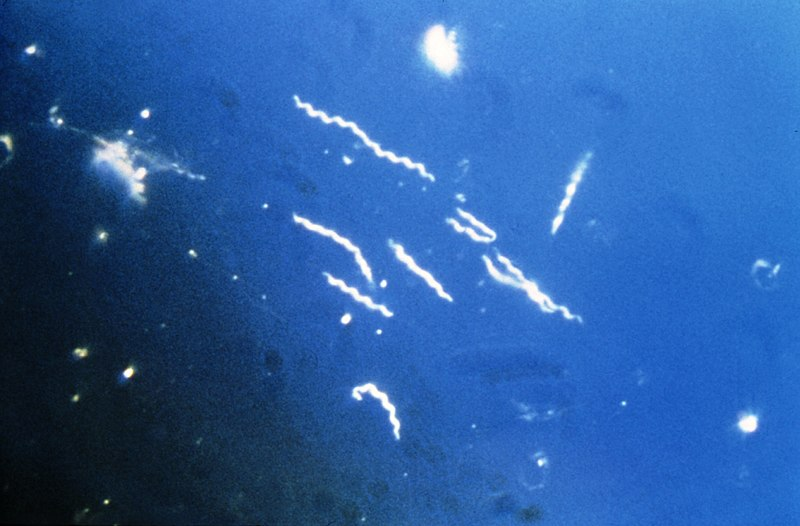

---
title: "Analysis"
author: "Vivian Li"
date: "January 24, 2019"
output: html_document
---

1. Import the Sequences.csv file.
```{r}
Bburg<-read.csv("Sequences1.csv")
Bburg
```


2. Using regular expressions, count the number of each base pair (A, T, C, and G) in each of the three sequences. 

```{r}
A<-
T<-
C<-
G<-
  
A<-grepl("^A", Bburg)
T<-grepl("T", Bburg)
C<-grepl("C", Bburg)
G<-grepl("G", Bburg)
```


3. Print out each sequence. 

## HQ433692.1
```{r}
print(Bburg[1,2])
```

## HQ433694.1
```{r}
print(Bburg[2,2])
```


## HQ433691.1

```{r}
print(Bburg[3,2])
```


4. Print out the number of each nucleotide for each of the three sequences. 

# Individual sequence analysis

---------------------

Sequence  | A | T | C | G 
----------|---|---|---|---
HQ433692.1| 1 | 2 | 3 |23
HQ433694.1|342| 12| 23|32
HQ433691.1|234| 43| 23|43


5. Include an image of a bacteria from the internet and a link to the Wikipedia page about *Borrelia burgdorferi*

[*Borrelia burgdorferi*](https://en.wikipedia.org/wiki/Borrelia_burgdorferi)




6. Calculate GC content and create a final table showing GC content for each sequence ID

# Summary GC content

---------------------

Sequence ID| GC Content 
-----------|------------
HQ433692.1 | 1 
HQ433694.1 |342
HQ433691.1 |234


8. Create an attractive, publication-worthy scatterplot of %GC using data from the file GC_content.csv. 
```{r}
library(ggplot2)
MyData<-read.csv("GC_content.csv")
MyData
GC<-((MyData$G+MyData$C)/100)

qplot(x=ID, y=GC, data=MyData, colour=Species, alpha=I(0.4),
      ylab= "Percent GC Content")
```

